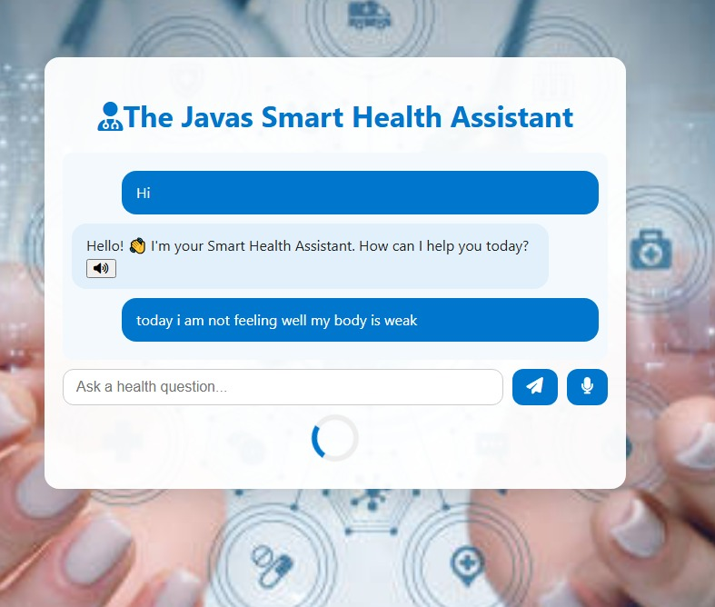

# Smart Health Assistant 

An AI-powered health assistant chatbot that answers user health-related queries using natural language. Built with Flask, Cohere API, and gTTS to support voice output.

##  Live Demo
[ Try it Now](https://smart-health-assistant-68gx.onrender.com/)

##  Screenshot
 
##  Features
- Conversational AI for health-related Q&A
- Voice output using gTTS (Google Text-to-Speech)
- Cohere API for generating intelligent responses
- Flask backend for handling inputs and API calls
- Deployed on Render

##  Technologies Used
- Python, Flask
- Cohere API (NLP)
- gTTS (Text-to-Speech)
- HTML, CSS
- Render (Deployment)

## ⚙ Setup Instructions
1. Clone the repo:
